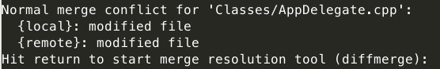
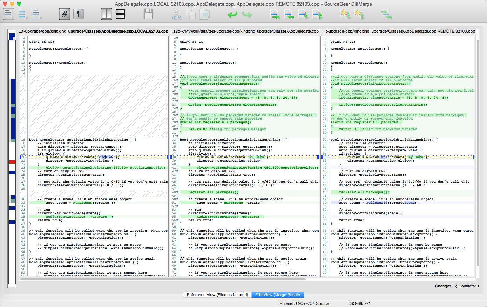

# cocos upgrade

## 简介

`cocos_upgrade.py` 是一个用于升级已有的 [cocos2d-x](https://github.com/cocos2d/cocos2d-x) 或 [cocos2d-js](https://github.com/cocos2d/cocos2d-js) 游戏工程中引擎版本的命令行工具。

## 适用范围

目前此工具适用的游戏工程：

* 游戏工程使用的引擎版本为 3.x
* 游戏工程是通过 `cocos new` 命令创建的。

适用的系统环境：

* Mac
* Windows

## 环境搭建

工具需要使用以下的软件环境：

1. Python 2.7 (目前只支持 Python 2.7 版本，不支持 Python 3.x 版本。[点此下载](https://www.python.org/downloads/))
2. Git ([点此下载](http://git-scm.com/downloads))

	* Mac 安装 Git 后，需要保证终端中可以执行 git 命令。
	* Windows 安装 Git 后，需要将 `[Git 安装目录]/cmd` 这个路径添加到 Path 环境变量中，以保证在 cmd 中可以调用 git 命令。

3. DiffMerge([点此下载](https://sourcegear.com/diffmerge/downloads.php))

	* Mac 安装 DiffMerge 后，需要将 `DiffMerge.app/Contents/Resources/diffmerge.sh` 拷贝到 `/usr/local/bin` 或者 `/usr/bin` 目录下，以保证在终端可以执行 `diffmerge.sh` 脚本。
	* Windows 安装 DiffMerge 后，需要将 `[DiffMerge 安装目录]` 添加到 Path 环境变量中，以保证在 cmd 中可以调用 `sgdm.exe`。

## 使用方法

1. 参数说明
	
	```
	usage: cocos_upgrade.py [-h] [-p PROJ_PATH] [-s SRC_ENGINE] [-d DST_ENGINE]

	可用参数:
  		-h, --help     显示帮助信息。
  		-p PROJ_PATH   指定游戏工程路径（可以为相对路径或者绝对路径）
  		-s SRC_ENGINE  指定原始版本引擎路径（可以为相对路径或者绝对路径）
  		-d DST_ENGINE  指定目标版本引擎路径（可以为相对路径或者绝对路径）
	```

2. 执行命令

	`python cocos_upgrade.py -p [工程路径] -s [原始引擎路径] -d [目标引擎路径]`

3. 解决冲突

	如果在升级过程中出现文件冲突，命令行窗口会逐个提示手动解决冲突。如下图所示：

	命令行提示冲突:		
	

	按回车进入手动解决冲突的界面:
	
	
	需要处理的冲突为界面最左边竖条内标记为红色的部分。在解决冲突的界面中：

	* 左边文件为游戏工程中的代码；
	* 右边文件为引擎升级的改动代码；
	* 中间文件为最终合并后的代码（只有此文件可以编辑）。
		
	冲突解决后，保存文件并关闭界面。命令行窗口会继续执行，直至所有冲突被解决。

4. 查看升级结果

	以上步骤执行完成后，游戏工程中的引擎版本就升级完成了。在原工程同级目录下会生成一个 `[工程名]_upgrade` 的文件夹，此文件夹就是升级后的引擎。如：
	
	* 原游戏工程路径为 `/Users/MyUserName/MyProjects/GameProject`
	* 升级后的游戏工程路径为 `/Users/MyUserName/MyProjects/GameProject_upgrade`
	
## 注意事项

* 目前只支持使用 DiffMerge 做为解决文件冲突的界面化工具。
* 在解决文件冲突的过程中，如果遇到 xcode 工程配置文件的冲突，建议打开冲突解决界面后，不进行手动操作，直接保存并标记为冲突已解决。然后在升级完成后，使用 xcode 打开有冲突的工程，重新添加源码以及资源文件即可。

## 实现方案说明

此工具的实现逻辑如下：

1. 从工程路径中解析工程相关的属性。
2. 使用解析出的工程属性，从原始版本引擎中新建一个空白工程。并将此空白工程初始化为一个 git 仓库。
3. 从 git 仓库的当前节点创建一个新的分支 upgrade_engine。
4. 使用解析出的工程属性，从目标版本引擎中新建一个空白工程。并将此空白工程提交到 upgrade_engine 分支。
5. 将游戏工程提交到 master 分支。
6. 使用 `git merge` 命令将 upgrade_engine 分支合并到 master 分支。
7. 如果合并过程中遇到冲突，则为这个 git 仓库配置 merge tool，并调用 `git mergetool` 开始逐个解决冲突。
